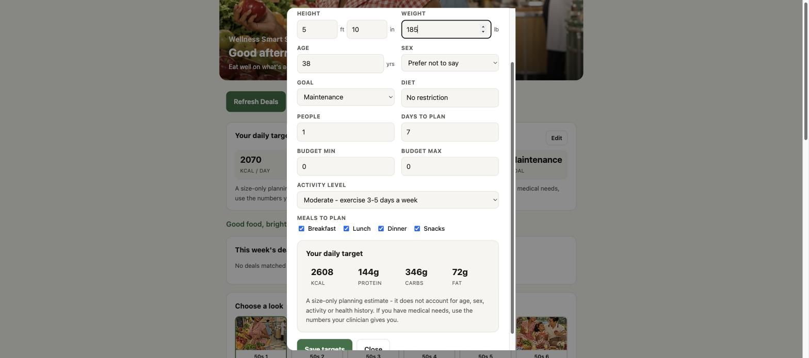
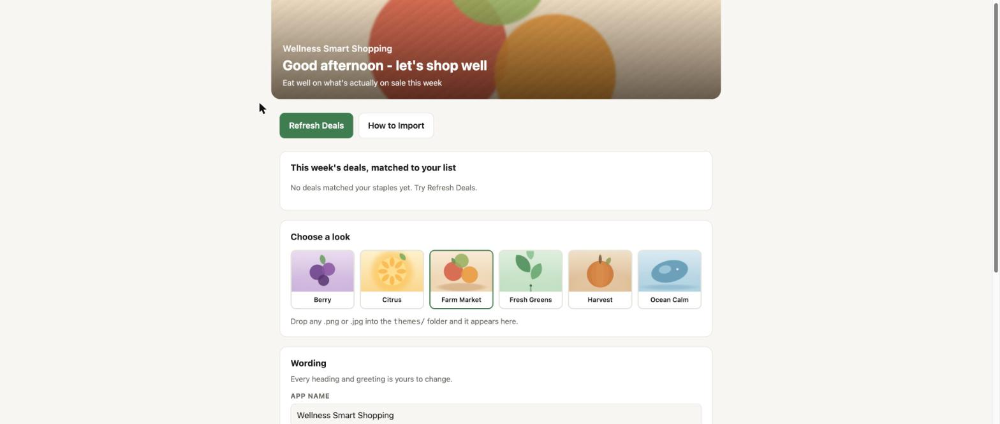
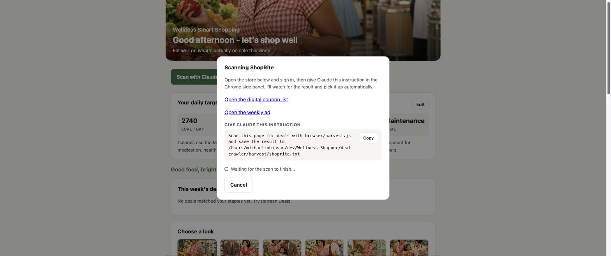

<h1>Wellness Smart Shopping</h1>

[](https://github.com/michael-m-robinson/wellness-smart-shopping/releases)
[](#what-you-need)
[](#the-companion-desktop-app)
[](#what-you-need)
[](LICENSE)
[](#whats-next)

**Turn this week's grocery sales into a shopping list that still hits your
nutrition targets.**

Wellness Smart Shopping reads the weekly deals, digital coupons and instant
savings from the store pages **you** are signed in to, matches them to the
staples on your list, and writes a small XML file. You import that file into the
[companion desktop app](#the-companion-desktop-app) and it re-prices your
list, re-ranks your recipes, and tells you what the trip should actually cost.

> **Free and open source.** Bring your own stores and your own accounts.
> Nothing here is tied to one household, one store or one region.

> 📱 **A mobile version is coming soon.**

---

## Where this came from

This started as a personal app. One household, one set of stores, one weekly
meal plan, built to answer a question that kept coming up: *what should we
actually buy this week so we eat well without overspending?*

It worked. And the more it worked, the more it seemed selfish to keep it on one
laptop. Plenty of people find the weekly shop genuinely hard -- not because they
do not know what good food looks like, but because planning it, pricing it and
timing it around what happens to be on sale is a real chore every single week.
That is the part a computer should be doing.

So it has been generalised and given away. Nothing is tied to one family, one
region or one set of stores any more: you bring your own stores, your own
accounts, your own wording and your own look. If it helps you get the right
food into the house each week with less effort, that is the whole point.

---

## Why this exists

Eating well is rarely a knowledge problem. Most people already know they should
buy more lean protein, more produce, more whole grains. The problem is that
those foods look expensive at the shelf, sales change every week, and the deals
that *would* make a healthy basket affordable are scattered across a paper
circular, a digital-coupon list behind a login, and an instant-savings booklet.

So the usual thing happens: you shop by habit, the healthy items get cut when
the total climbs, and the cheap calories stay in the cart.

This tool closes that gap.

- **It looks for deals on the food you actually want to eat.** The matcher only
  recognises staples — lean ground turkey, chicken breast, eggs, plain Greek
  yogurt, lentils, frozen fish, oats, brown rice, produce, olive oil, spices. A
  sale on candy, soda or snack bars is deliberately ignored, so a "good week"
  never means a week of junk.
- **It makes the healthy option the cheap option.** When the app knows chicken
  breast is $1.99/lb and lentils are on sale, it can build the same week of
  meals for less — instead of you discovering the deal after you have already
  bought something else.
- **It protects the nutrition targets.** The XML only adjusts *prices and
  limits*. The app still plans to your calorie and macro goals; a deal can
  change which protein you buy, not whether you hit your protein.
- **It respects purchase limits.** "Limit 4" is carried into the file, so the
  savings you are shown are savings you can really get at the register.
- **It is honest about what a deal is worth.** A `$3.99/lb` advertisement is
  converted into a real per-package price, "2 for $5" becomes a unit price, and
  a discount larger than the item's normal price is capped instead of being
  taken at face value.

The result: a weekly shop where the produce and lean protein survive the budget
cut, because the numbers are on their side.

---

## What you need

| Requirement | Why |
| --- | --- |
| **A Claude subscription** | Required. Every store is read by Claude from your own browser. |
| **[The Claude for Chrome extension](https://chromewebstore.google.com/detail/fcoeoabgfenejglbffodgkkbkcdhcgfn)** | Required for scanning. The panel links you to it if it is missing. |
| **Python 3.9+** | The crawler itself. Standard library only — nothing to install. |
| **Chrome, signed in to your stores** | Digital coupons and member pricing only exist inside your own logged-in session. |
| No network access of its own | This program never contacts a store. A test enforces it. |
| The Smart Shopping List desktop app | Optional. The XML is plain text and can be read by anything. |

> **Please sign in to your stores before crawling.** Most grocers serve deals
> only to a signed-in session. If you are signed out, the crawler will stop and
> print exactly which store needs you and which page to open — it will not
> quietly return an empty file.

**Why a Claude subscription is needed:** a store's real coupon list exists only
inside your signed-in session, and the pages that show it are JavaScript apps
that block plain scripts outright. There is no public feed to read. Rather than
scrape third-party coupon blogs -- which are noisy, often wrong, and not the
store's own numbers -- this project reads the genuine article: the page you
already have open, in your own browser, with your own account. That is what the
Claude for Chrome extension does.

A useful side effect: **this program has no network access at all.** It cannot
contact a store, so it cannot be blocked, rate-limited, or quietly scrape
anything on your behalf. It only ever reads a file you saved.

---

## Your daily targets

The first time you open the control panel it asks for a few details and works
out the calorie and macro targets your shopping list is sized around:

<p align="center"></p>

Height, weight, age, sex, activity and goal set the numbers -- the rest size the
shop itself. The target updates live as you type, so you can see what switching
from Maintenance to Cutting, or from Sedentary to Active, actually costs before
committing.

Press **Save targets** and it is written to `profile.json` on your machine and
reused from then on. Change it any time with **Edit** on the targets card; there
is no lock-in and nothing is uploaded.

### How the numbers are worked out

Calories come from the **Mifflin-St Jeor equation** -- the resting-energy formula
dietitians use -- multiplied by an activity factor:

| Activity | Factor | Extra protein |
| --- | --- | --- |
| Sedentary - little or no exercise | 1.20 | - |
| Light - 1-3 days a week | 1.375 | +0.05 g/lb |
| Moderate - 3-5 days a week | 1.55 | +0.08 g/lb |
| Active - 6-7 days a week | 1.725 | +0.12 g/lb |
| Very active - physical job or twice daily | 1.90 | +0.15 g/lb |

Training harder raises protein need, not just calories. Without that, the extra
energy would land almost entirely in carbohydrate, which is a poor split for
anyone actually training. Fat is likewise held to at least a quarter of
calories, so a high-activity target does not collapse into a near pure-carb plan.

Your goal then scales the result:

| Goal | Calories | Protein | Fat |
| --- | --- | --- | --- |
| Build Muscle | maintenance x 1.10 | 0.80 g/lb | 0.35 g/lb |
| Maintenance | maintenance x 1.00 | 0.70 g/lb | 0.32 g/lb |
| Cutting | maintenance x 0.84 | 0.75 g/lb | 0.30 g/lb |

Protein and fat come off a *planning weight* capped near BMI 25 plus 20%, so
targets stay sensible across body sizes rather than scaling without limit.
Carbohydrate fills the remaining calories.

**Sex** offers "Prefer not to say", which sits midway between the male and
female constants -- you get a usable number without disclosing it.

If you leave age blank, it falls back to the desktop app's original size-only
estimate, so an unfinished profile still produces workable numbers. There are
tests pinning both paths.

> **This is planning guidance, not clinical advice.** It cannot account for
> medication, health history, body composition or pregnancy. If you have medical
> or dietary needs, use the numbers your clinician gives you.

---

## The control panel

The easiest way to use this. One command:

```bash
python3 panel.py
```

or double-click **Start Panel.command** -- or just press **Scan with
Claude...** in the desktop app, which starts it for you. It opens a small page at `http://127.0.0.1:8765` -- entirely on your machine,
nothing uploaded anywhere -- with:

- **Scan with Claude** -- pick a store, Claude reads its deals from the page
  you are signed in to, and the panel offers to import the result.
- **Your daily target** -- calories and macros sized to you, editable any time.
- **Refresh Deals** -- checks every enabled store and writes the XML.
- **How to Import** -- step-by-step import instructions in a popup.
- **A sign-in panel** -- any store that needs an account is listed with a link
  to open it and instructions for the browser harvest.
- **A look picker** -- 26 bundled images, or drop your own into `themes/`.
- **Wording** -- edit the app name, greeting, tagline, headings and the
  shopping list message; all save straight to `branding.json`.

<p align="center"></p>

<p align="center"><em>Refresh, see what matched, import. That's the loop.</em></p>

### Scan with Claude

**Scan with Claude** runs the whole loop for you. Press it, pick a store, and
the panel hands you the exact instruction to give Claude:

<p align="center"></p>

1. **Pick a store.** Each one shows whether it has been scanned yet.
2. **Open it and sign in.** The panel links straight to that store's coupon list
   and weekly ad.
3. **Give Claude the instruction** (there is a Copy button) in the Chrome side
   panel, with the Claude for Chrome extension enabled.
4. **The panel watches for the result.** When Claude saves the scan, it is
   picked up automatically, matched against your staples, and turned into XML --
   no further clicking.
5. **It asks whether to import.** Say yes and it opens the app and reveals the
   file in Finder, with the path on your clipboard. Say **Not now** and it tells
   you exactly where the file is waiting, so you can import whenever you like:

```
/path/to/wellness-smart-shopping/out/shoprite-sales-2026-09-20.xml
```

Nothing is lost by declining -- the file keeps until you use **Import Sales
XML...** in the app. If the scan came through but nothing matched your staples,
it says so plainly rather than writing an empty file; that is just a quiet week
at that store.

#### If you do not have the extension yet

The panel says so on arrival, with a link to install it:

> **Scanning needs the Claude for Chrome extension** -- Scan with Claude reads
> deals from the store page you are signed in to, which the Claude for Chrome
> extension makes possible. Everything else here works without it.
> &nbsp; [Get the extension] &nbsp; [I already have it]

Press **I already have it** and the notice never comes back. Open the panel in a
browser that cannot run the extension and it says that instead.

A web page cannot truly detect an installed extension -- the resources this one
exposes are content-hashed and change with every release, so probing for them
would start reporting "missing" after any update. The notice therefore informs
rather than claims, and is dismissible. Only the browser itself is detected with
certainty.

**How to Scan** (inside the wizard) has the same directions in longhand if you
would rather read them first.

### The desktop app

The app's Swift source is in `app/`, so it builds from source:

```bash
cd app
./build.sh                      # -> build/Wellness Smart Shopping.app
./build.sh "My Shopping App"    # or under your own name
```

Needs the Swift toolchain from the Xcode command line tools
(`xcode-select --install`). macOS only. The build names the bundle, sets its
identifier, copies in the theme you picked in the control panel, and ad-hoc
signs it so macOS will open it.

**The coupon finder is gone.** Not relabelled -- deleted. The old build shipped
its own scraper: it fetched store pages, parsed them, and kept sign-in sessions
in an embedded browser. That is ~380 lines lighter now, and with it went the
hard-coded town and store branch the original was built around.

In its place the app has one button, **Scan with Claude...**, opening a small
panel that does three things and nothing else:

- **Start Control Panel** finds `panel.py`, starts it, shows progress while it
  comes up, opens your browser on it, and **stops it again when you quit the
  app**. If it cannot find the folder it asks you to point at it once, then
  remembers. Nothing to run by hand.
- **Import Sales XML...** applies the file a scan produced.
- **Clear Imported Deals**, and Close.

The per-item list of entry boxes is gone -- deals arrive from a scan, so there
was nothing left to type into it.

> **Keep the app next to the project folder, and keep Python 3 installed.**
> **Start Control Panel** runs `panel.py` for you, so it has to be able to find
> it. It looks in a folder you picked before, then beside the app, then the
> usual download and clone locations. **If you move the app somewhere unrelated
> it will ask you to point at the folder once**, and remember your answer after
> that. **Without Python 3 the button cannot start anything** -- the rest of the
> app still works, and you can always import a sales file by hand.

What survived untouched: the meal planner, recipes, PDF export, nutrition
targets, and the XML import. The app's own self-test still passes:

```bash
"build/Wellness Smart Shopping.app/Contents/MacOS/SmartShoppingList" \
    --self-test /tmp/a.pdf /tmp/b.pdf /tmp/c.pdf
```

Tests in `test_crawler.py` guard the removal, so the scraper cannot creep back.

> **Only have the binary?** `tools/retire_app_buttons.py` relabels and neuters a
> compiled bundle in place, for anyone without the source. Building from `app/`
> is better in every way and is the supported path.

### Make it sound like you

Every greeting and heading is data, not code. Copy the example and edit:

```bash
cp branding.example.json branding.json
```

```json
{
  "app_name": "Wellness Smart Shopping",
  "greeting_morning": "Good morning - let's shop well",
  "greeting_evening": "Good evening - let's plan the week",
  "tagline": "Eat well on what's actually on sale this week",
  "deals_header": "This week's deals, matched to your list",
  "theme": "farm-market"
}
```

Anything you leave out falls back to a sensible default, so a two-line
`branding.json` is perfectly valid. You can also edit the common fields straight
from the control panel and hit Save.

### Choosing a look

Twenty-six images ship with the project, in two kinds:

- **Six drawn by code** (`tools/make_themes.py`) -- abstract produce artwork that
  carries no third-party licence at all.
- **Twenty photographs** -- retro 1950s grocery scenes, training and strength,
  open air and green space, and a family at the table. These are AI-generated,
  commissioned for this project and contributed under the same MIT terms, so
  they carry no third-party claim and depict no real person.

Provenance and licensing for both kinds is recorded in
[themes/CREDITS.md](themes/CREDITS.md).

Pick one in the control panel and it becomes the banner; `personalize.py` can
push the same image into the desktop app. Drop any `.png` or `.jpg` into
`themes/` and it appears in the picker too. The grid loads small thumbnails
from `themes/thumbs/` so a large library stays quick.

If you add an image you did not make, check its licence before redistributing
it -- Unsplash, Pexels, Openverse and Wikimedia Commons are good sources, but
their terms vary image by image.

### Your shopping list message

The line above your shopping list is yours. Pick one of the presets in
**Wording**, or type your own:

> Good food, brighter days. &nbsp;&middot;&nbsp; Stronger, healthier, happier
> you. &nbsp;&middot;&nbsp; Progress looks good on you. &nbsp;&middot;&nbsp;
> Eat well. Spend less. Feel better.

It saves to `branding.json` with everything else.

### Personalising a build you already have

Building from `app/` already bakes in your name and theme. To change an existing
bundle without rebuilding:

```bash
python3 personalize.py --list
python3 personalize.py --name "My Shopping App" --theme farm-market --icon
```

It renames the bundle, swaps the picture the app shows, optionally rebuilds the
icon, backs up first, and re-signs so macOS still opens it. macOS only.

---

## Install

```bash
git clone https://github.com/michael-m-robinson/wellness-smart-shopping.git
cd wellness-smart-shopping
./install.command          # or: python3 installer.py
```

The setup wizard checks what your machine already has, offers to fix what is
missing, builds the desktop app, runs the tests and leaves you with a working
control panel. **Nothing is installed without asking, and nothing needs `sudo`.**
To look before you leap:

```bash
python3 installer.py --check     # report only, changes nothing
```

**One copy, always.** The app is installed to `~/Applications` and the wizard
removes any other copy of it -- two installed copies is a trap where you open
one, find the old build, and none of your changes are there. Copies are matched
by bundle identifier rather than name, so renaming a build with `build.sh` does
not sneak one past it, and that includes the staging copy `build.sh` leaves in
`app/build/`: macOS indexes it like any other app, so it appears in Launchpad
whether or not you think of it as installed. Removals are deregistered from
LaunchServices too, or the ghost lingers in Launchpad and Spotlight after the
files are gone. Older builds of the *original* app are listed but never removed
unless you say so -- they are yours.

If you have built the app by hand and want to tidy up without reinstalling:

```bash
python3 installer.py --check     # shows every copy it can find
```

> **There are no Python packages to install.** The crawler, the control panel
> and the wizard are standard library only, and the desktop app uses Apple's own
> frameworks with no Swift package dependencies. `requirements/requirements.txt`
> is deliberately empty -- nothing is downloaded at install time, nothing pins a
> version, and nothing can break when an upstream package changes. The real
> requirements are a handful of tools, listed in
> [requirements/README.md](requirements/README.md) and checked by the wizard.

Prefer to do it by hand? Copy the config and go:

```bash
cp config.example.json config.json
```

Then open `config.json` and set your stores:

```json
{
  "stores": {
    "shoprite": { "enabled": true, "store_id": "000" },
    "stews":    { "enabled": true },
    "costco":   { "enabled": true }
  },
  "per_weight": "convert",
  "snack_twins": true
}
```

Find `store_id` by opening your store on shoprite.com and copying the number
out of the URL: `.../rsid/<store_id>/...`.

---

## Use

```bash
# See what this week's deals match, without writing anything
python3 crawl.py --report

# Write the XML files
python3 crawl.py

# One store at a time
python3 crawl.py --stores costco

# How to scan each store, printed to the terminal
python3 crawl.py --scan-help

# Use a scan saved somewhere else
python3 crawl.py --harvest stews=~/Downloads/stews.txt
```

A store you have not scanned yet prints its own directions instead of failing
silently.

Files land in `out/`, one per store plus an optional combined file:

```
out/shoprite-sales-2026-09-20.xml
out/costco-sales-2026-09-20.xml
```

### Import into the app

In Smart Shopping List: **Import Sales XML…**, then choose a file from `out/`.
The app applies every offer whose `itemId` it recognises and ignores the rest.

> Account-clipped coupons still have to be clipped in your store account. The
> XML tells the app what a deal is worth; it cannot clip it for you.

---

## Options

| Flag | Effect |
| --- | --- |
| `--report` | Print matches and the reasoning behind each number; write nothing. |
| `--stores a,b` | Limit to specific stores. |
| `--harvest store=file` | Use a scan saved somewhere other than `harvest/`. |
| `--scan-help` | Print scanning directions for every store. |
| `--per-weight convert\|skip` | Convert `$/lb` deals to per-package (default) or drop them. |
| `--no-snack-twins` | Do not mirror a deal onto the snack line items. |
| `--combined` | Also write one all-stores file. |
| `--out DIR` | Change the output directory. |

---

## Adding your own store

No code required. Because nothing is fetched, a store is just a name and the
pages worth scanning -- add it to `config.json`:

```json
"stores": {
  "mymarket": {
    "enabled": true,
    "name": "My Local Market",
    "urls": [
      { "label": "Open the weekly ad", "url": "https://example.com/weekly-ad" },
      { "label": "Open digital coupons", "url": "https://example.com/coupons" }
    ]
  }
}
```

It appears in the control panel immediately, with its own scan directions and
its own `harvest/mymarket.txt`. The matcher, price maths and XML writer are
shared, so any store benefits from them.

## The sales XML format

**[docs/XML-IMPORT.md](docs/XML-IMPORT.md)** documents the file the app imports,
including the full list of catalog item IDs it accepts. The format is plain text
and deliberately simple, so you can generate it from a spreadsheet, a script, or
by hand -- this crawler is just one producer of it.

---

## What's next

- 📱 **A mobile version is coming soon** -- the control panel is already a web
  app, which is the groundwork for it.
- More stores. Adding one needs no code at all -- a name and the pages worth
  scanning, in `config.json`. Contributions welcome.
- The desktop app builds from source in `app/`, so it is open to changes too.

---

## Privacy

- The crawler and the control panel run entirely on your machine, and make no
  network requests of any kind.
- The panel binds to `127.0.0.1` only -- it is not reachable from
  your network.
- Your height, weight and goal stay in `profile.json` on your machine.
- **It never sees, asks for, or stores your store passwords.** Sign-in happens
  in your own browser; only the visible text of a page you already opened is
  ever read.
- `config.json`, `branding.json`, `profile.json`, `harvest/` and `out/`
  are git-ignored so your store numbers and
  local data stay off GitHub.

---

## License

[MIT](LICENSE) — free to use, change and redistribute, including commercially.
No warranty: advertised prices change, stores make mistakes, and the matcher is
heuristic. Always check your receipt.
