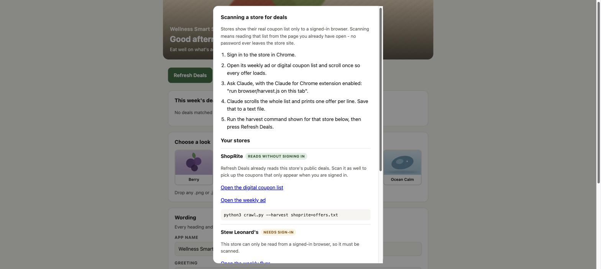

<h1>Wellness Smart Shopping</h1>

[](https://github.com/michael-m-robinson/wellness-smart-shopping/releases)
[](#what-you-need)
[](#the-companion-desktop-app)
[](#what-you-need)
[](LICENSE)
[](#whats-next)

**Turn this week's grocery sales into a shopping list that still hits your
nutrition targets.**

Wellness Smart Shopping reads the weekly deals, digital coupons and instant
savings from the store pages **you** are signed in to, matches them to the
staples on your list, and writes a small XML file. You import that file into the
[companion desktop app](#the-companion-desktop-app) and it re-prices your
list, re-ranks your recipes, and tells you what the trip should actually cost.

> **Free and open source.** Bring your own stores and your own accounts.
> Nothing here is tied to one household, one store or one region.

> 📱 **A mobile version is coming soon.**

---

## Where this came from

This started as a personal app. One household, one set of stores, one weekly
meal plan, built to answer a question that kept coming up: *what should we
actually buy this week so we eat well without overspending?*

It worked. And the more it worked, the more it seemed selfish to keep it on one
laptop. Plenty of people find the weekly shop genuinely hard -- not because they
do not know what good food looks like, but because planning it, pricing it and
timing it around what happens to be on sale is a real chore every single week.
That is the part a computer should be doing.

So it has been generalised and given away. Nothing is tied to one family, one
region or one set of stores any more: you bring your own stores, your own
accounts, your own wording and your own look. If it helps you get the right
food into the house each week with less effort, that is the whole point.

---

## Why this exists

Eating well is rarely a knowledge problem. Most people already know they should
buy more lean protein, more produce, more whole grains. The problem is that
those foods look expensive at the shelf, sales change every week, and the deals
that *would* make a healthy basket affordable are scattered across a paper
circular, a digital-coupon list behind a login, and an instant-savings booklet.

So the usual thing happens: you shop by habit, the healthy items get cut when
the total climbs, and the cheap calories stay in the cart.

This tool closes that gap.

- **It looks for deals on the food you actually want to eat.** The matcher only
  recognises staples — lean ground turkey, chicken breast, eggs, plain Greek
  yogurt, lentils, frozen fish, oats, brown rice, produce, olive oil, spices. A
  sale on candy, soda or snack bars is deliberately ignored, so a "good week"
  never means a week of junk.
- **It makes the healthy option the cheap option.** When the app knows chicken
  breast is $1.99/lb and lentils are on sale, it can build the same week of
  meals for less — instead of you discovering the deal after you have already
  bought something else.
- **It protects the nutrition targets.** The XML only adjusts *prices and
  limits*. The app still plans to your calorie and macro goals; a deal can
  change which protein you buy, not whether you hit your protein.
- **It respects purchase limits.** "Limit 4" is carried into the file, so the
  savings you are shown are savings you can really get at the register.
- **It is honest about what a deal is worth.** A `$3.99/lb` advertisement is
  converted into a real per-package price, "2 for $5" becomes a unit price, and
  a discount larger than the item's normal price is capped instead of being
  taken at face value.

The result: a weekly shop where the produce and lean protein survive the budget
cut, because the numbers are on their side.

---

## What you need

| Requirement | Why |
| --- | --- |
| **A Claude subscription** | Required. Every store is read by Claude from your own browser. |
| **The Claude for Chrome extension** | Required. This is what runs the scan inside the store page you are signed in to. |
| **Python 3.9+** | The crawler itself. Standard library only — nothing to install. |
| **Chrome, signed in to your stores** | Digital coupons and member pricing only exist inside your own logged-in session. |
| No network access of its own | This program never contacts a store. A test enforces it. |
| The Smart Shopping List desktop app | Optional. The XML is plain text and can be read by anything. |

> **Please sign in to your stores before crawling.** Most grocers serve deals
> only to a signed-in session. If you are signed out, the crawler will stop and
> print exactly which store needs you and which page to open — it will not
> quietly return an empty file.

**Why a Claude subscription is needed:** a store's real coupon list exists only
inside your signed-in session, and the pages that show it are JavaScript apps
that block plain scripts outright. There is no public feed to read. Rather than
scrape third-party coupon blogs -- which are noisy, often wrong, and not the
store's own numbers -- this project reads the genuine article: the page you
already have open, in your own browser, with your own account. That is what the
Claude for Chrome extension does.

A useful side effect: **this program has no network access at all.** It cannot
contact a store, so it cannot be blocked, rate-limited, or quietly scrape
anything on your behalf. It only ever reads a file you saved.

---

## The control panel

The easiest way to use this. One command:

```bash
python3 panel.py
```

It opens a small page at `http://127.0.0.1:8765` -- entirely on your machine,
nothing uploaded anywhere -- with:

- **Refresh Deals** -- checks every enabled store and writes the XML.
- **How to Scan** -- step-by-step directions for reading a store's coupon list
  from your signed-in browser, with the exact page to open and the exact
  command to run, per store.
- **How to Import** -- step-by-step import instructions in a popup.
- **A sign-in panel** -- any store that needs an account is listed with a link
  to open it and instructions for the browser harvest.
- **A look picker** -- six bundled images, or drop your own into `themes/`.
- **Wording** -- edit the app name, greeting, tagline and headings, and they
  save straight to `branding.json`.

<p align="center"></p>

<p align="center"><em>Refresh, see what matched, import. That's the loop.</em></p>

### Scanning a store

Every store is read the same way: from a page you are signed in to. **How to
Scan** in the control panel gives you the link to open and the exact file to
save, per store:

<p align="center"></p>

The short version:

1. Sign in to the store in Chrome.
2. Open its weekly ad or digital coupon list and scroll once so every offer loads.
3. Ask Claude, with the Claude for Chrome extension enabled:
   *"run browser/harvest.js on this tab"*.
4. Claude scrolls the whole list and prints one offer per line. Save that as
   `harvest/shoprite.txt` (the panel shows the exact path for each store).
5. Press **Refresh Deals**, or run:

```bash
python3 crawl.py
```

`examples/sample-scan.txt` shows the shape of a scan if you want to try the
pipeline before scanning anything real:

```
Boneless Skinless Chicken Breast | $1.99/lb | Limit 4
93% Lean Ground Turkey | $3.49 | Limit 2
Large Eggs 18 ct | $2.49 |
```

```bash
python3 crawl.py --harvest shoprite=examples/sample-scan.txt --report
```

Your password never leaves the store's own site -- scanning only reads the
visible text of a page you already opened. If you are signed out,
`harvest.js` says so rather than handing back an empty list.

### Retiring the app's old coupon button

The bundled desktop app carries an older built-in "Find Official Offers" /
Connect Account panel that predates this project. Scanning replaces it: it
handles more stores, honours purchase limits, and writes a file the app imports
directly.

The app is a compiled binary with no source, so that button cannot be deleted --
deleting it means changing code, and there is no code to change. It can,
however, be **relabelled in place** so nobody walks into the dead end:

```bash
python3 tools/retire_app_buttons.py --app "/Applications/Your App.app" --dry-run
python3 tools/retire_app_buttons.py --app "/Applications/Your App.app"
```

"Find Official Offers" becomes "Use Control Panel", and the panel's help text
points at `panel.py` > How to Scan. This is a byte-for-byte, same-length edit of
string data only -- Swift stores a literal's length as an instruction immediate,
so a replacement of identical length cannot shift the binary's layout. The tool
backs the binary up outside the bundle first, re-signs afterwards so macOS still
opens the app, and undoes itself:

```bash
python3 tools/retire_app_buttons.py --app "..." --restore "<the .bak file>"
```

macOS only. The button still exists and still works -- it is now signposted
rather than removed. Removing it outright needs the app rebuilt from source.

### Make it sound like you

Every greeting and heading is data, not code. Copy the example and edit:

```bash
cp branding.example.json branding.json
```

```json
{
  "app_name": "Wellness Smart Shopping",
  "greeting_morning": "Good morning - let's shop well",
  "greeting_evening": "Good evening - let's plan the week",
  "tagline": "Eat well on what's actually on sale this week",
  "deals_header": "This week's deals, matched to your list",
  "theme": "farm-market"
}
```

Anything you leave out falls back to a sensible default, so a two-line
`branding.json` is perfectly valid. You can also edit the common fields straight
from the control panel and hit Save.

### Choosing a look

Six images ship with the project: `fresh-greens`, `farm-market`, `citrus`,
`berry`, `harvest`, `ocean-calm`.

They are **drawn by code, not downloaded** (`tools/make_themes.py`), so they
carry no third-party licence and you can redistribute them freely with the rest
of the project. Want a photo instead? Drop any `.png` or `.jpg` into `themes/`
and it appears in the picker. Good sources for genuinely free photography are
Unsplash, Pexels, Openverse and Wikimedia Commons -- check each image's licence
before you redistribute it.

### Renaming and re-skinning the desktop app

The desktop app's text is compiled in, but its name and its picture are not:

```bash
python3 personalize.py --list
python3 personalize.py --name "Wellness Smart Shopping" --theme farm-market --icon
```

This renames the bundle, swaps the picture the app displays, optionally rebuilds
the icon, takes a timestamped backup first, and re-signs the bundle so macOS
still opens it. macOS only.

---

## Install

```bash
git clone https://github.com/michael-m-robinson/wellness-smart-shopping.git
cd wellness-smart-shopping
cp config.example.json config.json
```

Then open `config.json` and set your stores:

```json
{
  "stores": {
    "shoprite": { "enabled": true, "store_id": "000" },
    "stews":    { "enabled": true },
    "costco":   { "enabled": true }
  },
  "per_weight": "convert",
  "snack_twins": true
}
```

Find `store_id` by opening your store on shoprite.com and copying the number
out of the URL: `.../rsid/<store_id>/...`.

---

## Use

```bash
# See what this week's deals match, without writing anything
python3 crawl.py --report

# Write the XML files
python3 crawl.py

# One store at a time
python3 crawl.py --stores costco

# How to scan each store, printed to the terminal
python3 crawl.py --scan-help

# Use a scan saved somewhere else
python3 crawl.py --harvest stews=~/Downloads/stews.txt
```

A store you have not scanned yet prints its own directions instead of failing
silently.

Files land in `out/`, one per store plus an optional combined file:

```
out/shoprite-sales-2026-09-20.xml
out/costco-sales-2026-09-20.xml
```

### Import into the app

In Smart Shopping List: **Import Sales XML…**, then choose a file from `out/`.
The app applies every offer whose `itemId` it recognises and ignores the rest.

> Account-clipped coupons still have to be clipped in your store account. The
> XML tells the app what a deal is worth; it cannot clip it for you.

---

## Options

| Flag | Effect |
| --- | --- |
| `--report` | Print matches and the reasoning behind each number; write nothing. |
| `--stores a,b` | Limit to specific stores. |
| `--harvest store=file` | Use a scan saved somewhere other than `harvest/`. |
| `--scan-help` | Print scanning directions for every store. |
| `--per-weight convert\|skip` | Convert `$/lb` deals to per-package (default) or drop them. |
| `--no-snack-twins` | Do not mirror a deal onto the snack line items. |
| `--combined` | Also write one all-stores file. |
| `--out DIR` | Change the output directory. |

---

## Adding your own store

No code required. Because nothing is fetched, a store is just a name and the
pages worth scanning -- add it to `config.json`:

```json
"stores": {
  "mymarket": {
    "enabled": true,
    "name": "My Local Market",
    "urls": [
      { "label": "Open the weekly ad", "url": "https://example.com/weekly-ad" },
      { "label": "Open digital coupons", "url": "https://example.com/coupons" }
    ]
  }
}
```

It appears in the control panel immediately, with its own scan directions and
its own `harvest/mymarket.txt`. The matcher, price maths and XML writer are
shared, so any store benefits from them.

## The companion desktop app

The XML format is documented in **[docs/XML-IMPORT.md](docs/XML-IMPORT.md)**,
including the full list of catalog item IDs the importer accepts. The format is
plain text and deliberately simple, so you can generate it from a spreadsheet,
a script, or by hand — this crawler is just one producer.

---

## What's next

- 📱 **A mobile version is coming soon** -- the control panel is already a web
  app, which is the groundwork for it.
- More store sources. Contributions welcome: a store is usually one small
  parser and a URL.

---

## Privacy

- The crawler and the control panel run entirely on your machine, and make no
  network requests of any kind.
- The panel binds to `127.0.0.1` only -- it is not reachable from
  your network.
- **It never sees, asks for, or stores your store passwords.** Sign-in happens
  in your own browser; only the visible text of a page you already opened is
  ever read.
- `config.json`, `branding.json`, `harvest/` and `out/` are git-ignored so your store numbers and
  local data stay off GitHub.

---

## License

[MIT](LICENSE) — free to use, change and redistribute, including commercially.
No warranty: advertised prices change, stores make mistakes, and the matcher is
heuristic. Always check your receipt.
